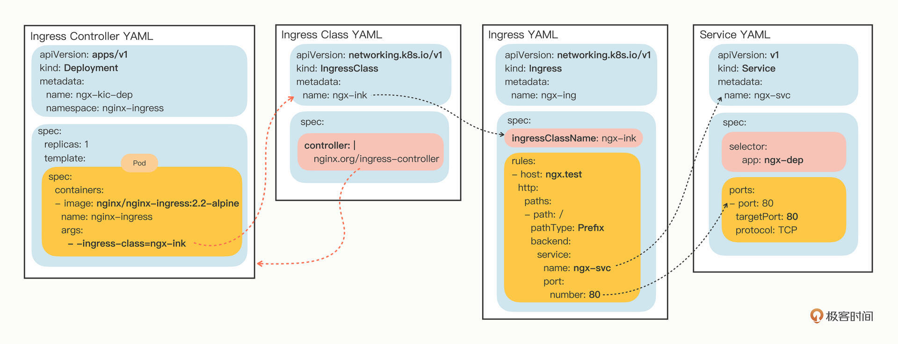

# Ingress





### ingress

```yaml
apiVersion: networking.k8s.io/v1
kind: IngressClass
metadata:
  name: nginx-ingressclass

spec:
  controller: nginx.org/ingress-controller

---

apiVersion: networking.k8s.io/v1
kind: Ingress
metadata:
  creationTimestamp: null
  name: nginx-ingress
spec:
  ingressClassName: nginx-ingressclass
  rules:
  - host: nginx-test.com
    http:
      paths:
      - backend:
          service:
            name: nginx-service
            port:
              number: 80
        path: /
        pathType: Exact
status:
  loadBalancer: {}
```

