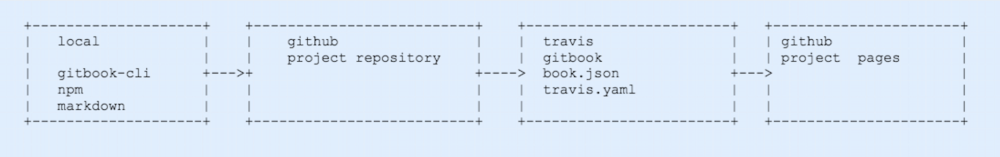

### 文件目录

```php
.
├── .git  //git文件目录 由git init生成
├── .gitignore  //忽略文件
├── .idea  
├── LICENSE 
├── README.md //可放置自动构建状态  gitbook 主页连接等
├── SUMMARY.md //目录
├── assets //其他资源文件 比如内嵌的图片
├── book.json //gitbook 配置
├── node_modules //gitbook 配置依赖和主题依赖
├── package-lock.json //依赖包
└── styles //样式自定义
```


### Book.json

```json
"styles": {
	"website": "styles/website.css"         
    } #定义外部样式引用
"fontsettings": {
            "theme": "night",
            "family": "sans" 
        }#定义默认主体及字体
```

默认主体及字体只能在github pages有效或者默认的直接使用构建出的源文件有效 由github同步直gitbook之后，新版的gitbook不支持自定义默认主体和字体

### Assets

引用资源目录

### Summary

目录文件，依赖gitbook-summary

```bash
npm install -g gitbook-summary
book sm
```

可以按数字前缀排列目录的顺序

### 构建流程图



Usage

1. 采用模板形式生成项目

2. 克隆到开发环境之后 安装gitbook依赖

   ​	1) gitbook-cli 需要提前安装好

   ​	2) 安装依赖 gitbook install   也可以直接软链应该安装的外部node_modules

3. 修改自动构建配置
